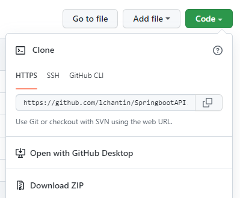

# SpringbootAPI

## API features

SpringbootAPI contains 2 features :
* One that allows to register a user 
* One that displays the details of a registered user

A user is defined by:
* A user name
* Birthdate a country of residence
* A user has optional attributes:
* A phone number
* A gender

Only adult French residents are allowed to create an account.

##How to install and run the project

1. Copy the path https://github.com/lchantin/SpringbootAPI.git.

    

2. Open your IDE (IntelliJ) and copy this path to import the project.
3. Checkout on the main branch.
4. Go to SpringbootapiApplication.class and run the project.

## How to use the API

link swagger